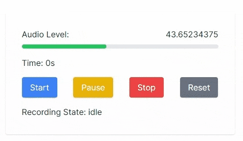
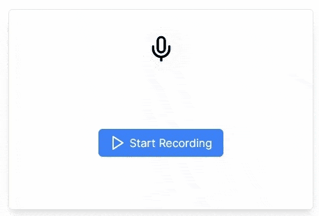

# react-microphone-recorder

A convenient and powerful React hook and component for audio recording with customizable options and audio levels.

<!-- Show `recorder-demo.gif` here -->

]

## Live Demo

[](https://react-microphone-recorder.vercel.app/)

<!-- Render Gifs here -->

## Table of Contents

- [react-microphone-recorder](#react-microphone-recorder)
  - [Features](#features)
  - [Installation](#installation)
  - [Usage](#usage)
    - [`useRecorder`](#userecorder)
    - [`RecordAudio`](#recordaudio)
  - [Contributing](#contributing)
  - [License](#license)

## Features

1. `useRecorder` - A React hook that provides audio recording functionalities and exposes several useful properties.
2. `RecordAudio` - A pre-built, beautifully designed React component for audio recording.
3. Full TypeScript support.

## Installation

Using npm:

```bash
npm install react-microphone-recorder
```

Or using yarn:

```bash
yarn add react-microphone-recorder
```

## Usage

### `useRecorder`

```jsx\
import { useRecorder } from 'react-microphone-recorder';

function MyComponent() {
  const { audioLevel, startRecording, pauseRecording, stopRecording, resetRecording, time, audioURL, recordingState, isRecording, audioFile } = useRecorder();

  // use these values in your component
}
```

Properties exposed by `useRecorder`:

- `audioLevel`: A floating-point number that changes with the microphone audio recording levels as the user starts recording.
- `startRecording`, `pauseRecording`, `stopRecording`, `resetRecording`, `resumeRecording`: Functions to control the recording.
- `timeElapsed`: A number that represents the time elapsed since the recording started.
- `recordingState`: A string that represents the current recording state. Can be one of "idle", "recording", "stopped", "paused".
- `isRecording`: A boolean that indicates whether the recording is currently active.
- `audioURL`: A string that holds the URL of the recorded audio.
  recordingState: A string that represents the current recording state. Can be one of "idle", "recording", "stopped", "paused".
- `isRecording`: A boolean that indicates whether the recording is currently active.
- `audioFile`: A File object that represents the recorded audio in "mp3" format.
- `audioBlob`: A Blob object that represents the recorded audio in mp3 format. `audioFile`, `audioURL` are created from this blob.

### `RecordAudio`

Simply import the `RecordAudio` component and all you need to do is pass the `audioFile` property to it. The component will take care of the rest.

```jsx
import { RecordAudio } from 'react-microphone-recorder'

function MyComponent() {
  // ... get audioURL and audioFile ...
  const [audioFile, setAudioFile] = (useState < File) | (undefined > undefined)

  return <RecordAudio audioFile={audioFile} />
}
```



> **Warning**
> The `RecordAudio` component is styled using Tailwind CSS. It's important to note that the styles will only be correctly applied if your project is set up with Tailwind CSS. If your project does not use Tailwind CSS, the component will still function correctly, but it will not have the intended visual style.
> If you are not using Tailwind CSS and still want to use the `RecordAudio` component, you may need to manually adjust the styles to suit your project's styling solution. Alternatively, consider setting up Tailwind CSS in your project, which can be done following the instructions on the [official Tailwind CSS documentation](https://tailwindcss.com/docs/guides/create-react-app).

> **Note**
> Use `useRecorder` if you want to build your own custom UI for audio recording.

## Contributing

Contributions are welcome! Please open an [issue](https://https://github.com/dinakar17/react-microphone-recorder/issues) or submit a [pull request](https://github.com/dinakar17/react-microphone-recorder/pulls)

## License

This project is licensed under the MIT License - see the [LICENSE](LICENSE) file for details.
